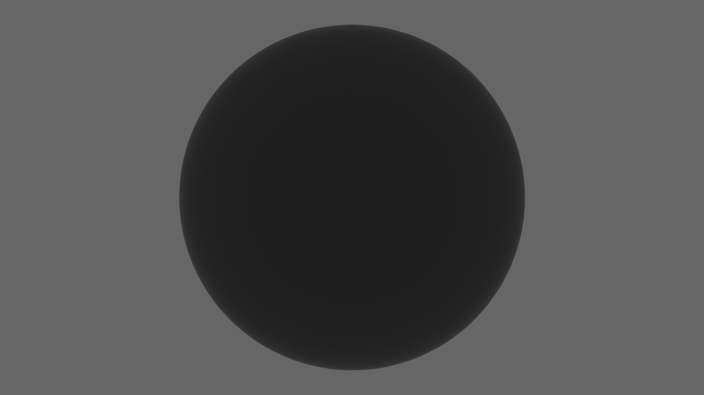

  <h1><code>houtu</code></h1>

  <strong>webgpu based high performance 3D region rendering engine inspired by <a href="https://github.com/frewsxcv/rgis">rgis</a>.</strong>

  <h3>
    <a href="#">document</a>
     | 
    <a href="#">online demo</a>
  </h3>

  Built by <a href="https://github.com/catnuko">catnuko</a>

## 🖼️screenshot

## 🚀feature
1. bevy
2. webgpu
3. rust
4. desktop and web browser app
5. plugin

## 🐪roadmap
1. 3d globe and camera
2. basic geometry
3. raster tile
4. vector tile
5. 3d tile
## 📖document
[中文文档](./README_zh.md)

## 💻development
Welcome to contribute code

## 🐒test
