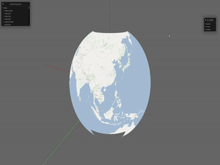

<div align="center">

  <h1><code>HouTu</code></h1>

  <strong>webgpu based high performance 3D earth rendering engine</strong>

  <h3>
    <a href="https://houtu.vercel.app/">website</a>
    <span> | </span>
    <a href="https://github.com/catnuko/houtu/discussions">discussions</a>
    <span> | </span>
    <a href="https://imdodo.com/s/211509">dodo交流群-后土地球</a>
    <span> | </span>
    <a href="https://github.com/catnuko/houtu/blob/master/README_ZH.md">中文</a>
  </h3>
</div>

# ⚠️This is very much work in progress, please use it with discretion.

## Screenshot

Layers of the web Mercator projection，Tile resources from [omniscale](https://maps.omniscale.net),thanks.



## 🔥Introduction
Use bevy as rendering engine, open source free 3D Earth rendering engine for web side.

Very early stage of the project, look forward to working with you to build the future.

## 🚀Feature
1. Pluggable:with bevy as the rendering engine, plugins can be flexibly customized.
2. Web-Oriented:render to browser using wasm+webgpu.
3. Precision:reference cesium, with practical, GIS graphic accuracy.
## 🌎Roadmap
[projects](https://github.com/users/catnuko/projects/1)
1. - [x] 3d globe
2. - [x] camera control
3. - [ ] base geometry，point,polyline,polyogn...
4. - [x] raster tile layer with wgs84 and webmercator projection.
5. - [ ] vector tile layer in mvt format.
6. - [ ] cesium 3d tile layer
7. - [ ] terrain
## 📖Documentation
1. chinese development experience，[理论3D地球](https://www.taihe.one/tag/%E7%90%86%E8%AE%BA%E5%9C%B0%E7%90%83)

## 💻Development
```bash
# run
cd houtu-app
cargo run

# It doesn't work in the browser for now

# Run in a browser using a trunk
cd houtu-app
# Yes, you can skip it
cargo install trunk wasm-bindgen-cli
# Start the service and the console will give the service address，http://127.0.0.1:8080
trunk serve

# Run it in a browser with wasm-server-runner
cd houtu-app
cargo run --target wasm32-unknown-unknown
wasm-server-runner ../target/wasm32-unknown-unknown/debug/houtu-app.wasm

# build
cd houtu-app
cargo build

// Running website
cd website
pnpm install
pnpm docs:dev
```

## 💓Contribution
Welcome to participate in development.👏👏👏