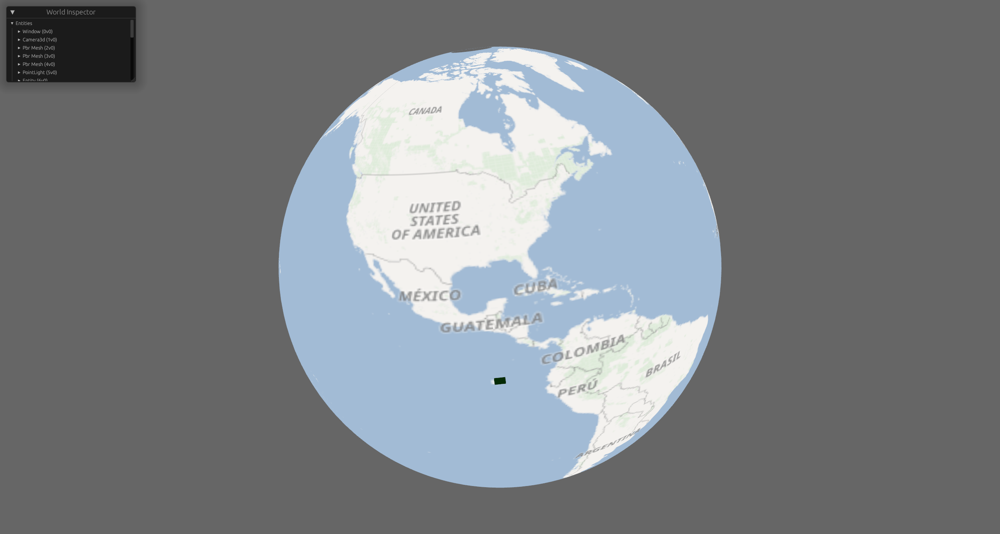

  <h1><code>houtu</code></h1>

  <strong>基于webgpu的高性能3D地球引擎</strong>

  <h3>
    <a href="#">文档</a>
     | 
    <a href="#">示例</a>
  </h3>

## 截图

第二层瓦片网格

## 🚀特性
1. bevy
2. webgpu
3. rust
4. desktop and web browser app

## 路线
1. - [x] 3d globe
2. - [x] camera
3. - [ ] basic geometry，poline，polygon，point，box，sphere等
4. - [x] raster tile
5. - [ ] vector tile
6. - [ ] 3d tile
7. - [ ] terrain
## 📖文档
document

## 💻贡献
[开发文档](./DEVELOPMENT.md)

## 🐒测试
