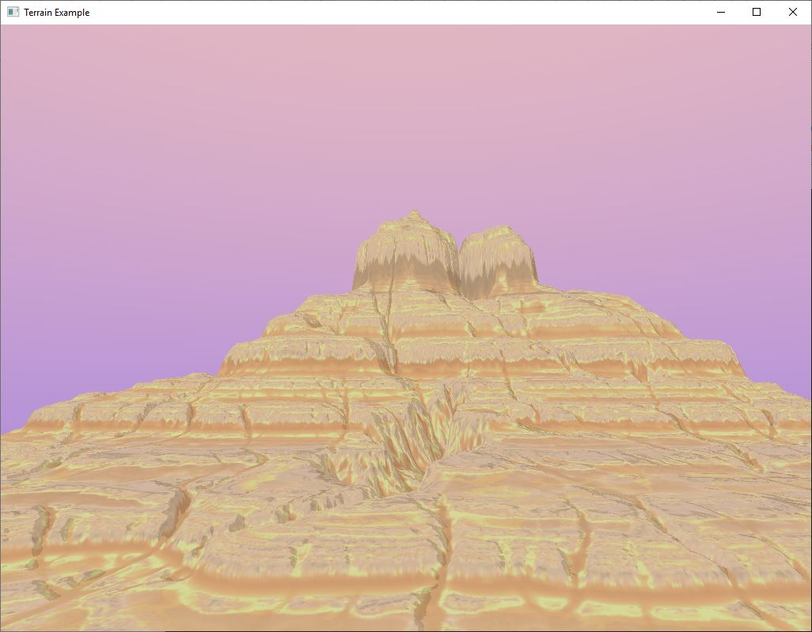

# Amethyst_terrain

## What is this?
This is an experimental render pass for terrains in Amethyst using [Cardinal Neighbor Quadtrees][cnquadtree] and tesselation for Level-of-Detail.

[cnquadtree]: https://doi.org/10.5120/ijca2015907501

## Principles
A terrain heightmap is split based on the distance to the viewer using Cardinal Neighbor Quadtrees.
Each leaf is tesselated in regards to its neighbor to avoid T-Junctions.

After that, a basic quad mesh is drawn using instanced attributes for each leaf.

## Future
Tries to have comparable performance to major engine solutions.
The first step is Unreal and Unity final step would be FarCry5's engine e.g.

Some specific targets are:
* Asset streaming and thus splitting of the terrain assets (heightmap, etc.) into tiles for each leaf
* Decals
* Support in amethyst-atelier and the editor
* Fallback for lower spec systems without tesselation support

## Limitations
This approach uses tesselation and geometry shaders and thus does currently not support Metal or older OpenGL versions

## What's in here
* A [cnquadtree][cnquadtree_crate] crate implementing the algorithm from Safwan W. Qasem and Ameur A.
* The render pass for Amethyst in the crate [amethyst_terrain][amethyst_terrain_crate]
* A simple demonstration crate implementing a [game][game_crate] with a simple terrain created with Gaea

[cnquadtree_crate]: cnquadtree
[amethyst_terrain_crate]: amethyst_terrain
[game_crate]: amethyst_terrain

## Inspiration
This approach was inspired by 
* https://github.com/drecuk/QuadtreeTerrain/blob/master/30.SYS-QuadtreeTerrain/TileTree.cpp
* https://bitbucket.org/victorbush/ufl.cap5705.terrain/src/93c5ab3824a5a66d87d1bb6dcc9ed9aee7a16357/src_non_uniform/shader/?at=master
* https://developer.nvidia.com/gpugems/GPUGems2/gpugems2_chapter07.html 
* and the FarCry5 GDC Slides.
